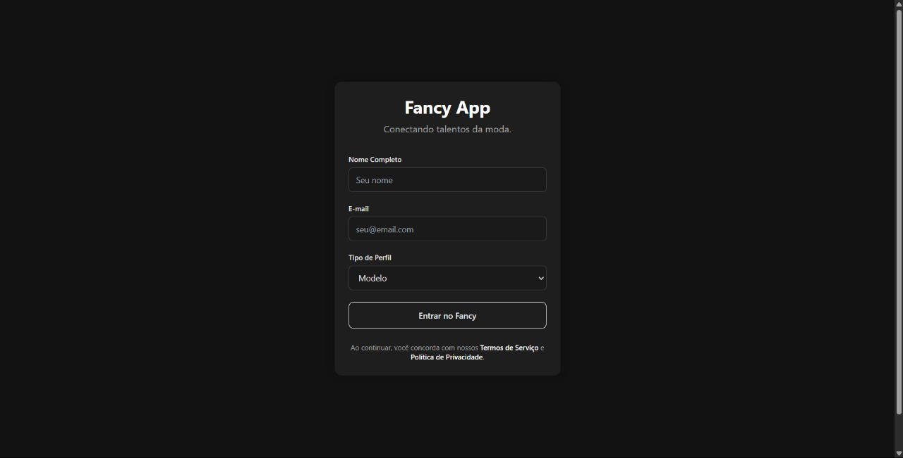
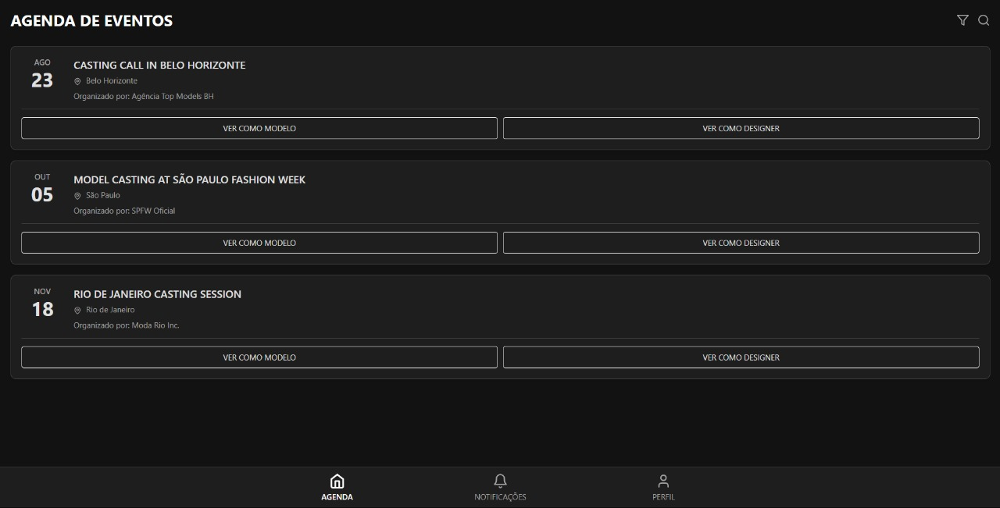
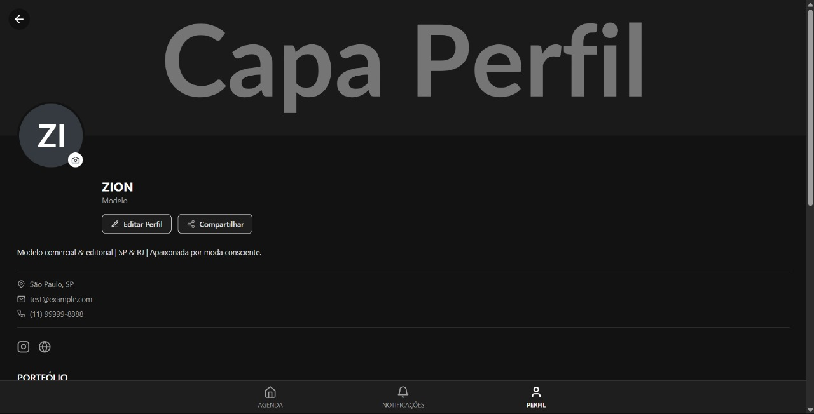
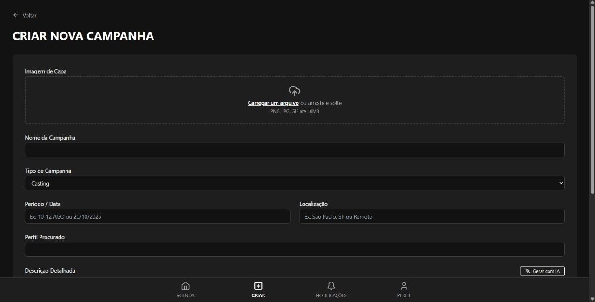

# 🎨 Fancy - Plataforma de Conexão para o Mundo da Moda



## 📱 Sobre o Projeto

Fancy é uma plataforma moderna que conecta profissionais do mundo da moda, incluindo modelos, marcas, agências e designers. O projeto foi desenvolvido com React, Vite e Tailwind CSS, oferecendo uma experiência de usuário fluida e elegante.

## ✨ Funcionalidades

- **Autenticação Personalizada**: Login adaptado para diferentes tipos de usuários (Modelos, Marcas, Agências, Designers)
- **Feed de Eventos**: Visualização de castings, desfiles e oportunidades
- **Criação de Campanhas**: Interface intuitiva para marcas e agências criarem novas oportunidades
- **Perfil Profissional**: Portfólio, estatísticas e informações de contato
- **Sistema de Notificações**: Mantenha-se atualizado sobre novas oportunidades
- **Design Responsivo**: Experiência otimizada para desktop e mobile

## 🛠️ Tecnologias Utilizadas

- React 18
- Vite
- Tailwind CSS
- Lucide Icons
- PostCSS
- ESLint

## 📸 Screenshots

### Tela de Login


### Feed de Eventos


### Perfil do Usuário


### Criação de Campanha


## 🎯 Estrutura do Projeto

```
fancy/
├── src/
│   ├── components/     # Componentes reutilizáveis
│   ├── screens/        # Telas da aplicação
│   ├── config.js       # Configurações e dados mock
│   ├── App.jsx         # Componente principal
│   └── main.jsx        # Ponto de entrada
├── public/            # Arquivos estáticos
└── index.html         # Template HTML
```

## 🤝 Contribuindo

1. Faça um Fork do projeto
2. Crie uma Branch para sua Feature (`git checkout -b feature/AmazingFeature`)
3. Faça o Commit das suas mudanças (`git commit -m 'Add some AmazingFeature'`)
4. Faça o Push para a Branch (`git push origin feature/AmazingFeature`)
5. Abra um Pull Request

## 📝 Licença

Este projeto é proprietário e confidencial. Todos os direitos reservados. Veja o arquivo [LICENSE](LICENSE) para mais detalhes.

## 👥 Autores

- **DLZ** - [GitHub](https://github.com/DeLazzari808)
