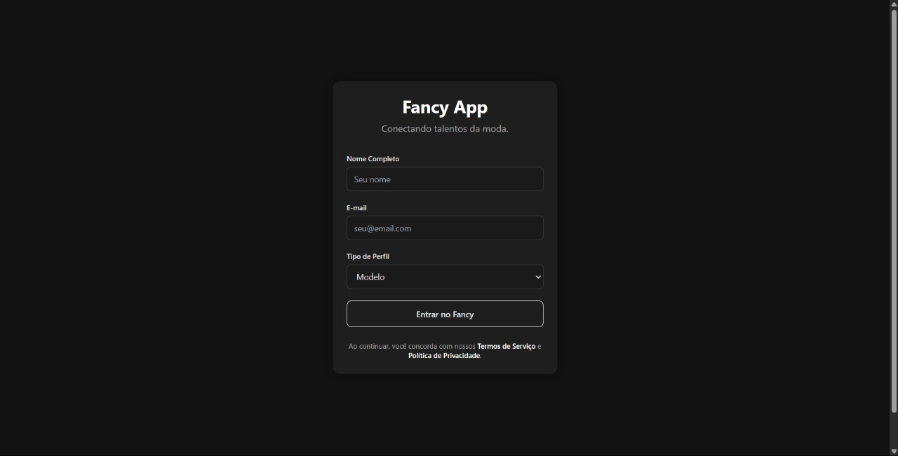
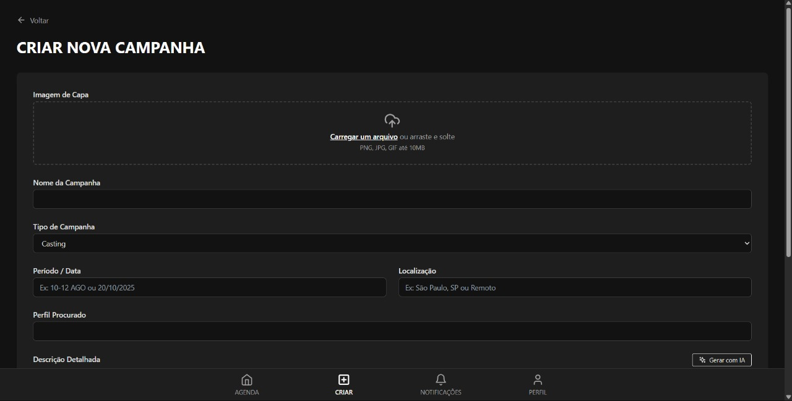

# Mode - Landing Page

Landing page moderna e responsiva para o projeto Mode, uma plataforma fictícia que conecta profissionais da indústria da moda. Este projeto foi desenvolvido para fins de portfólio, demonstrando habilidades em front-end, design responsivo e uso de Tailwind CSS.

## Sobre o Projeto

O Mode é uma proposta de solução digital para centralizar processos, simplificar conexões e otimizar oportunidades no setor da moda. A landing page apresenta o conceito, funcionalidades e diferenciais da plataforma, além de um formulário para registro antecipado.

## Funcionalidades em Destaque

- Design moderno, elegante e tema escuro
- Totalmente responsivo para todos os dispositivos
- Animações suaves de entrada das seções
- Navegação fluida entre seções
- Formulário de registro para acesso antecipado
- Seção de eventos e agenda inteligente
- Destaque para uso de Inteligência Artificial
- Prints ilustrativos dos principais fluxos

## Tecnologias Utilizadas

- HTML5
- CSS3
- JavaScript (ES6+)
- Tailwind CSS (via CDN)
- Google Fonts

## Como Visualizar

1. Faça o clone deste repositório ou baixe os arquivos
2. Abra o arquivo `index.html` em seu navegador

Não é necessário instalar dependências ou rodar servidor, pois a página utiliza recursos via CDN.

## Estrutura de Arquivos

- `index.html` — Estrutura principal da landing page
- `styles.css` — Estilos personalizados
- `script.js` — Animações e interações
- `assets/` — Vídeos e imagens de fundo
- `Dune/screenshots/` — Prints ilustrativos da plataforma

## Screenshots

Veja abaixo alguns exemplos de telas presentes na pasta `Dune/screenshots/`:

| Login | Feed de Eventos | Criar Campanha | Perfil do Usuário |
|-------|-----------------|---------------|-------------------|
|  |  |  |  |

## Licença

Este projeto está disponível para fins de estudo e portfólio. 